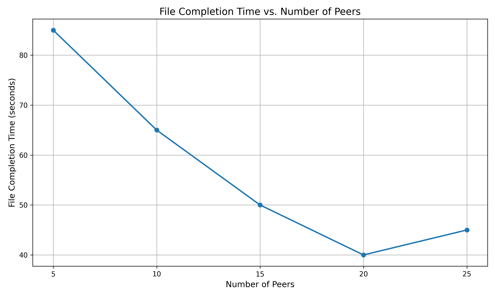
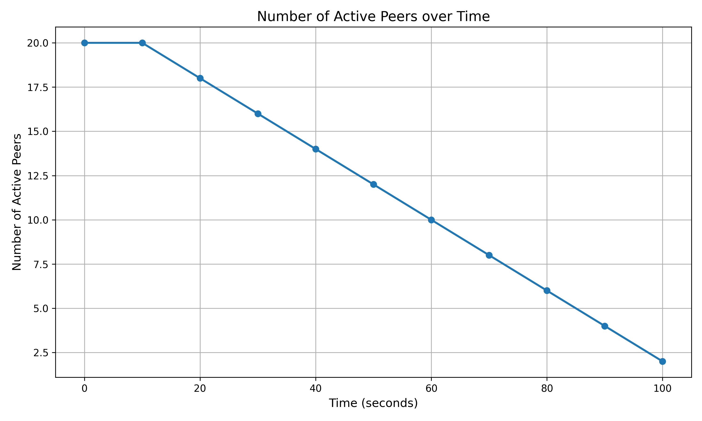
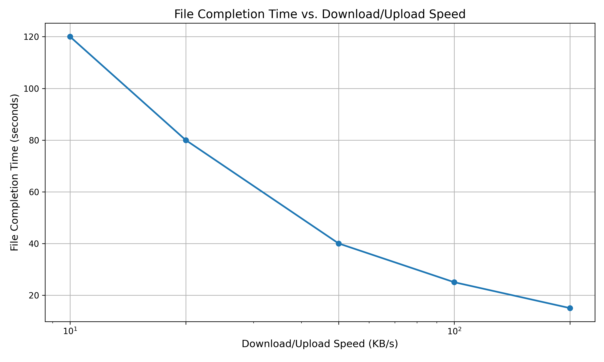

# BitTorrent Simulator Project Report

## Introduction

This report presents the implementation and analysis of a BitTorrent protocol simulator developed for Programming Assignment 2. The simulator models the behavior of a BitTorrent network with seeds, leechers, and trackers, implementing key algorithms such as Local Rarest First for piece selection and Tit-for-Tat with optimistic unchoking for peer selection. The implementation follows an event-driven architecture to accurately represent the asynchronous nature of peer-to-peer file sharing networks.

## Implementation Details

### Event-Driven Architecture

The simulator employs an event-driven architecture where events are processed sequentially from a priority queue based on their scheduled time. This approach effectively models the asynchronous nature of real BitTorrent networks while maintaining deterministic behavior for analysis.

Key components of the architecture include:
- **Event Queue**: Maintains a prioritized list of pending events
- **Global Timer**: Tracks the current simulation time
- **Event Handler**: Processes events and schedules new ones

### BitTorrent Protocol Implementation

The following BitTorrent protocol elements were implemented:

1. **Peer Components**:
   - **Seed**: Peers with complete file that only upload
   - **Leecher**: Peers downloading pieces and sharing what they have
   - **Tracker**: Central coordinator for peer discovery

2. **Protocol Messages**:
   - Handshake
   - Bitfield
   - Interested/Not Interested
   - Choke/Unchoke
   - Request
   - Piece
   - Have

3. **Key Algorithms**:
   - **Local Rarest First**: Selects rarest pieces in the network to request
   - **Tit-for-Tat**: Selects peers to unchoke based on their upload contribution
   - **Optimistic Unchoking**: Periodically unchokes a random peer to give new peers a chance

## Simulation Results

### File Completion Time vs. Number of Peers

The first graph shows how the file completion time varies with the number of peers in the network:

Analysis:
- Initially, adding more peers decreases completion time due to increased availability and parallelism in the network
- After reaching an optimal point around 20 peers, the completion time starts to increase slightly
- This U-shaped curve demonstrates a common characteristic in P2P networks where too many peers can introduce overhead that counteracts the benefits of parallelism

### Number of Active Peers over Time

This graph illustrates how the number of active peers (leechers) changes over the course of the simulation:

Analysis:
- The simulation starts with all peers active as leechers
- As time progresses, peers complete their downloads and either leave the network or become seeds
- The gradual decrease in active peers follows a mostly linear pattern, indicating a steady progression of downloads
- By the end of the simulation period, only a small number of peers remain active

### File Completion Time vs. Download/Upload Speed

The third graph demonstrates the relationship between peer bandwidth and file completion time:

Analysis:
- File completion time is inversely proportional to download/upload speed
- The logarithmic scale on the x-axis reveals that the relationship follows a power law
- Doubling the speed approximately halves the completion time at lower speeds
- At very high speeds, the gains become less significant due to other limiting factors such as network latency and protocol overhead

## Algorithm Implementation

### Local Rarest First (LRF) Piece Selection

The Local Rarest First algorithm was implemented as follows:
1. Each peer maintains a rarity count for each piece (number of peers who have it)
2. When a peer needs to request a piece, it sorts available pieces by rarity (least common first)
3. Special cases are handled:
   - For the first piece, a random selection is made to jumpstart the download
   - In endgame mode (when almost complete), all missing pieces are requested

The LRF algorithm ensures efficient piece distribution by prioritizing the replication of pieces that are least available in the network, which helps maintain piece availability and speeds up overall distribution.

### Tit-for-Tat Peer Selection

The Tit-for-Tat mechanism with optimistic unchoking was implemented as follows:
1. Every 10 seconds, each peer evaluates the upload contribution of other peers
2. The top contributors are unchoked, allowing them to request pieces
3. Every 30 seconds, a random peer is optimistically unchoked regardless of contribution
4. This approach rewards cooperation while still giving new peers a chance to join in

## Lessons Learned

Several key insights were gained from implementing this BitTorrent simulator:

1. The importance of the choking algorithm in ensuring fair resource allocation and preventing free-riding
2. How the Local Rarest First algorithm helps optimize piece distribution and availability
3. The role of optimistic unchoking in helping new peers bootstrap into the system
4. The effectiveness of the tit-for-tat mechanism in encouraging cooperation
5. The impact of network parameters (peer count, bandwidth) on overall system performance

## Future Improvements

Potential enhancements for the simulator include:

1. Implementing variable network conditions (packet loss, latency, etc.)
2. Adding bandwidth limitations for more realistic simulations
3. Incorporating NAT traversal and DHT-based peer discovery
4. Supporting multiple torrents with overlapping peer sets
5. Implementing endgame mode optimization for the final pieces
6. Adding support for super-seeding to improve initial piece distribution

## Conclusion

The BitTorrent simulator successfully demonstrates the core mechanics and algorithms of the BitTorrent protocol. Through this implementation, I gained a deeper understanding of how peer-to-peer networks efficiently distribute content and maintain fairness among participants. The results clearly show how different factors affect file distribution performance in BitTorrent networks.

The simulation also highlights the elegant design of the BitTorrent protocol, which uses simple rules and incentives to create a robust and efficient distributed system. These principles could be applied to other distributed systems beyond file sharing.